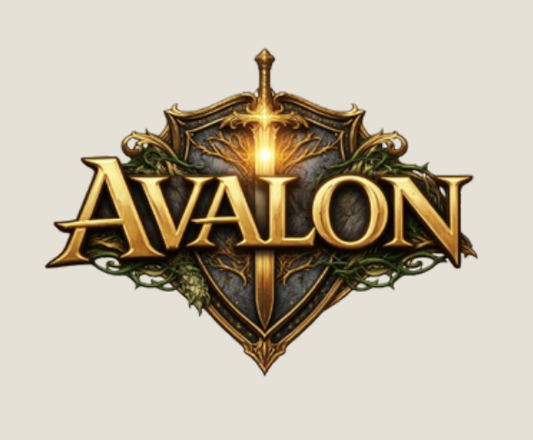

# Ficha Avalon

Webapp pra preencher, marcar e rabiscar a ficha de RPG do sistema **Avalon**, em qualquer aparelho e qualquer rede.

## Funcionalidades

- **6 páginas**: frente (atributos, PV, armadura, vínculos, pets, itens) → energia arcana + corrupção + anotações → habilidades adquiridas → background do personagem (aparência/personalidade/história/objetivos) → encontros (tabela com modal de notas) → diário de sessões.
- **Sync em servidor**: estado guardado em `data/ficha.json`. Editou no notebook, abriu no celular → tá lá. Polling a cada 8s + save automático debounced.
- **Cache offline**: se o servidor cair, segue editando — quando voltar, sincroniza.
- **Export/Import JSON** pra backup local.
- **Modo caneta** pra rabiscar livre por cima de qualquer página (cor, espessura, borracha, desfazer).
- **Encontros**: tabela com nome + descrição curta, botão `✎` abre modal com anotações longas.
- **PWA**: instala no celular como app, funciona offline (cai pra cache local).
- **Auth**: Basic Auth pro acesso externo (LAN passa livre).

## Stack

- Python 3.10+ / Flask (serve estáticos + sync de estado)
- HTML + CSS + JS vanilla (sem build, sem framework)
- ngrok pra expor pra internet

## Como rodar local

Duplo-clique em `Iniciar.bat` (instala Flask na 1ª execução). Abre em `http://127.0.0.1:5050`.

Pra acesso externo (celular fora de casa), abrir também `scripts/Iniciar-Tunel-Ngrok.bat` — dá uma URL `*.ngrok-free.dev` que funciona em qualquer rede.

URL atual (domínio fixo do plano free): **https://vitally-anaconda-tarantula.ngrok-free.dev/**
Login: `lucas` (definido em `data/.env`).

## Estrutura

```
ficha-rpg-avalon/
├── Iniciar.bat                ← sobe o Flask (porta 5050)
├── app.py                     ← Flask: estáticos + auth + /api/state
├── index.html                 ← markup das 6 páginas + modal
├── style.css                  ← visual completo
├── app.js                     ← persistência, canvas, encontros, sync
├── manifest.webmanifest       ← PWA
├── sw.js                      ← service worker (cache offline)
├── data/
│   ├── .env                   ← APP_USER, APP_PASS, NGROK_AUTHTOKEN (gitignored)
│   ├── .env.example
│   └── ficha.json             ← estado salvo (gitignored)
├── scripts/
│   └── Iniciar-Tunel-Ngrok.bat
└── docs/
    ├── SESSION.md
    └── CHECKPOINTS.md
```

## API de sync

- `GET /api/state` → `{ campos, tinta }`. `campos.encontros` é um array.
- `POST /api/state` → recebe `{campos, tinta}`, persiste em `data/ficha.json` (gravação atômica via tmpfile + rename).

## Como instalar no celular como app (PWA)

1. Abre a URL no Safari (iPhone) ou Chrome (Android).
2. **iPhone**: botão de compartilhar → "Adicionar à Tela de Início".
3. **Android**: menu (3 pontinhos) → "Instalar app" / "Adicionar à tela inicial".
4. Vira ícone na home, abre fullscreen, funciona offline.

## Como funciona o salvamento

- **Auto-save**: tudo que você escreve, marca ou rabisca é salvo automaticamente no `localStorage` do navegador. Indicador "salvando…/salvo" no topo.
- **Cada aparelho tem sua cópia**: o navegador do notebook não vê o do celular. Pra passar de um pro outro, use **Exportar** (baixa um JSON) e **Importar** (carrega o JSON no outro aparelho).
- **Reset**: apaga tudo (campos + rabiscos). Recomendo exportar antes.

## Modo caneta

- Clica em **✎ Caneta** pra ativar (atalho: tecla `P`).
- Cor e espessura ajustáveis ao lado.
- **⌫ Borracha** apaga só o que você desenhou (atalho `E`).
- **↶ Desfazer** remove o último traço (atalho Ctrl+Z).
- **🧽 Limpar** apaga todos os rabiscos (pede confirmação).
- Enquanto a caneta tá ativa, os campos da ficha ficam congelados. Clica de novo pra desativar.

## Estrutura

```
ficha-rpg-avalon/
├── index.html              ← markup das 3 páginas
├── style.css               ← visual + responsivo + print
├── app.js                  ← persistência, canvas, export/import, PWA
├── manifest.webmanifest    ← metadados do PWA
├── sw.js                   ← service worker (cache offline)
├── README.md
└── docs/
    ├── SESSION.md
    └── CHECKPOINTS.md
```

## Quero trocar o logo de texto pelo logo bonito

1. Salva o PNG/SVG do logo em `assets/avalon.png`.
2. No `index.html`, substitui cada `<div class="logo-avalon">AVALON</div>` por:
   ```html
   
   ```
3. No `style.css`, adiciona:
   ```css
   .logo-avalon-img { max-width: 220px; height: auto; display: block; margin: 0 auto; }
   ```
